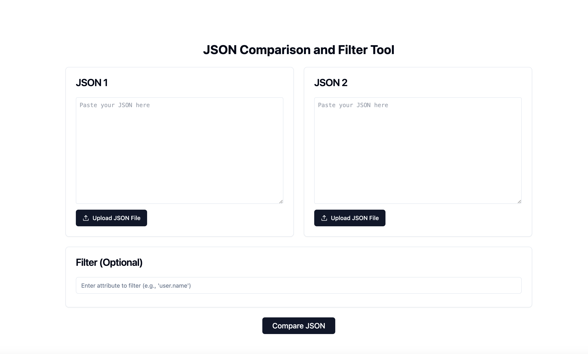

# JSON Comparison Tool

This project is a JSON comparison tool built using Next.js. It allows users to compare two JSON objects to identify differences and similarities. The tool provides a user-friendly interface to visualize the comparison results.

## Features

- **JSON Input**: Easily input JSON objects for comparison.
- **Detailed Comparison**: Highlights differences and similarities between JSON objects.
- **User-Friendly Interface**: Interactive and easy-to-navigate frontend.

## Getting Started

1. **Clone the Repository**
    ```sh
    git clone https://github.com/ftchvs/json-comparison-tool.git
    cd json-comparison-tool
    ```

2. **Install Dependencies**
    ```sh
    npm install
    ```

3. **Run the Development Server**
    ```sh
    npm run dev
    ```
    Open [http://localhost:3000](http://localhost:3000) in your browser to see the result.

## Project Structure

- **components/**: React components used in the project.
- **lib/**: Library functions for JSON comparison.
- **pages/**: Next.js pages for routing.
- **public/**: Static assets.
- **styles/**: CSS and styling files.

## Usage

1. Enter the two JSON objects in the provided text areas.
2. Click on the "Compare" button to see the differences highlighted.

## Screenshots



## Technologies Used

- **Next.js**: React framework for server-side rendering.
- **Tailwind CSS**: Utility-first CSS framework for styling.
- **TypeScript**: Typed superset of JavaScript.

## Prerequisites

Make sure you have the following installed:
- Node.js (v14 or later)
- npm (v6 or later)

## Learn More

To learn more about Next.js and its features, visit the [Next.js Documentation](https://nextjs.org/docs).

## Deploy on Vercel

Easily deploy this app using the [Vercel Platform](https://vercel.com).

## Contributing

Contributions are welcome! Please follow these steps to contribute:
1. Fork the repository.
2. Create a new branch (`git checkout -b feature-branch`).
3. Commit your changes (`git commit -m 'Add some feature'`).
4. Push to the branch (`git push origin feature-branch`).
5. Open a pull request.

Please make sure to update tests as appropriate.

## License

This project is licensed under the MIT License - see the [LICENSE](LICENSE) file for details.

## Acknowledgements

- [Next.js Documentation](https://nextjs.org/docs)
- [Tailwind CSS Documentation](https://tailwindcss.com/docs)
- [TypeScript Documentation](https://www.typescriptlang.org/docs/)

---

Feel free to contribute to this project by forking the repository and submitting pull requests. For major changes, please open an issue to discuss what you would like to change.

For more details, visit the [GitHub repository](https://github.com/ftchvs/json-comparison-tool).
